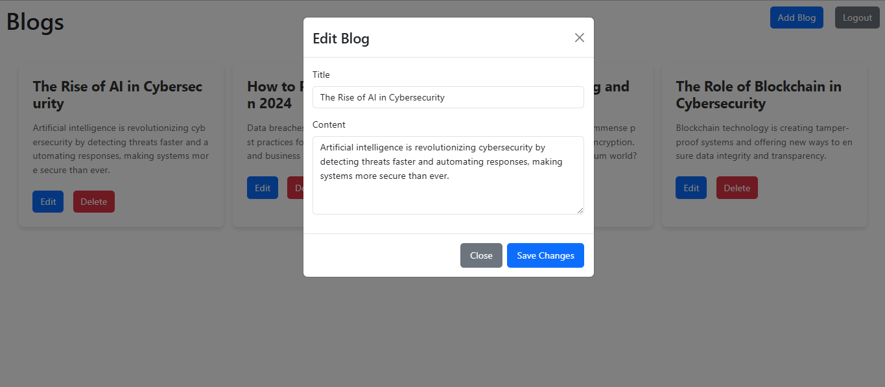

# VRV Security’s Backend Developer Intern Assignment

## Description
This is a blog application that allows users to sign up, log in, and view blogs related to technology and cybersecurity. The application features user authentication, protected routes, and dynamic blog rendering. Built using React, it integrates with an API for user authentication and blog management.

---
**FRONTEND GITHUB:**
https://github.com/saran-mani/vrv-frontend-assignment.git

**BACKENDEND GITHUB:**
https://github.com/saran-mani/vrv-backend-assignment.git

## Credentials For testing
- user
  `email : user@gmail.com`
  `password : user1234`
- admin
  `email : admin@gmail.com`
  `password : admin1234`
- moderator
  `email : moderator@gmail.com`
  `password : moderator1234`

## Security Measures 

### Frontend Security
1. **Token Storage:**
   - User tokens are securely stored in `localStorage` to maintain authentication state.
   - Sensitive data is not exposed to the frontend.

2. **Route Protection:**
   - Implemented a `ProtectedRoute` component to ensure only authenticated users can access specific routes like `/home`.
   - Users without valid tokens are automatically redirected to the `/signin` page.

3. **Validation:**
   - Input validation on the client side prevents malformed data from being sent to the server.
   - Prevents submission of empty or invalid email and password fields during sign-up and login.

### Backend Security
1. **API Authentication:**
   - Token-based authentication implemented using JSON Web Tokens (JWT).
   - Tokens are validated on every request to secure endpoints.

2. **Password Encryption:**
   - Passwords are hashed using algorithms like `bcrypt` before storing them in the database.
   - Plaintext passwords are never stored.

3. **Error Handling:**
   - Detailed error messages are only provided to authenticated users or logged securely on the backend.
   - General error messages are shown to unauthorized users to prevent information disclosure.

4. **Cross-Origin Resource Sharing (CORS):**
   - Configured CORS policies to only allow requests from trusted origins.

5. **Rate Limiting and Throttling:**
   - Prevents brute-force attacks by limiting the number of login attempts from a single IP address.

6. **Input Sanitization:**
   - All user input is sanitized to prevent SQL and NoSQL injection and cross-site scripting (XSS) attacks.

---

## Best Practices Followed
1. **Token Expiry:**
   - JWT tokens have an expiration time to minimize risks if compromised.
   - Users need to re-authenticate after the token expires.

2. **Session Management:**
   - Tokens are cleared from `localStorage` upon user logout.

---

## API Endpoints

### Authentication
- **Sign in**: `POST api/v1/user/auth/sign_in`
- **Sign up**: `POST api/v1/user/auth/sign_up`

### Blogs
- **Get all blogs**: `GET api/v1/blog`
- **Create a blog**: `POST api/v1/blog`
- **Edit a blog**: `PATCH api/v1/blog/:blogId`
- **Delete a blog**: `DELETE api/v1/blog/:blogId`

---

## Tech Stack

- **Frontend**: React.js
- **Backend**: Node.js

---

## Features

### 1. Sign-Up Page
Users can create an account by providing the required details.

### 2. Login Page
Users can log in with their credentials to access their account.

### 3. User Home Page
Users can view blogs related to technology and cybersecurity.

### 4. Admin Home Page

Admins can:
- Edit blogs.

- Delete blogs.

- Add new blogs.

### 5. Moderator Home Page
Moderators can edit the blogs.

---
